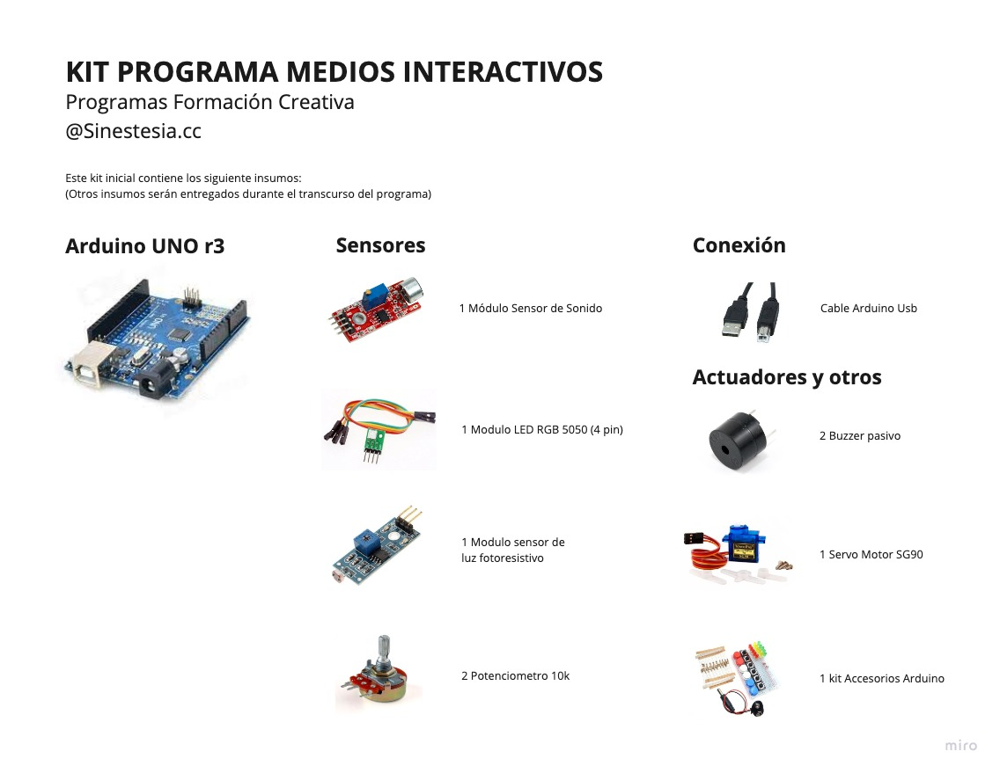

# 2-objetos-electronicos

## Estructura del repositorio

- [clase1.md](clase1.md): miercoles 10 de mayo
- [clase2.md](clase2.md): miercoles 17 de mayo
- [clase3.md](clase3.md): miercoles 24 de mayo
- [ejemplos/](ejemplos/): carpeta con los ejemplos de código.

## Profesor

Sergio Mora-Diaz

## Software

Este módulo se imparte con el software Arduino IDE, disponible para descarga en: https://www.arduino.cc/

En mayo 2023, usaremos la versión 2.1.0

Para el correcto uso de la placa Arduino con el chip CH340G, es necesario además descargar e instalar los drivers disponibles en:
http://www.wch-ic.com/downloads/CH341SER_ZIP.html (Windows) o http://www.wch-ic.com/downloads/CH341SER_MAC_ZIP.html (Mac).

## Bibliografía

- Libro de Proyectos de Arduino
  http://ibsteam.caib.es/wp-content/uploads/sites/108/2020/02/Libro_de_Proyectos_de_Arduino_Starter_Kit.pdf
  
 ## Kit de materiales

