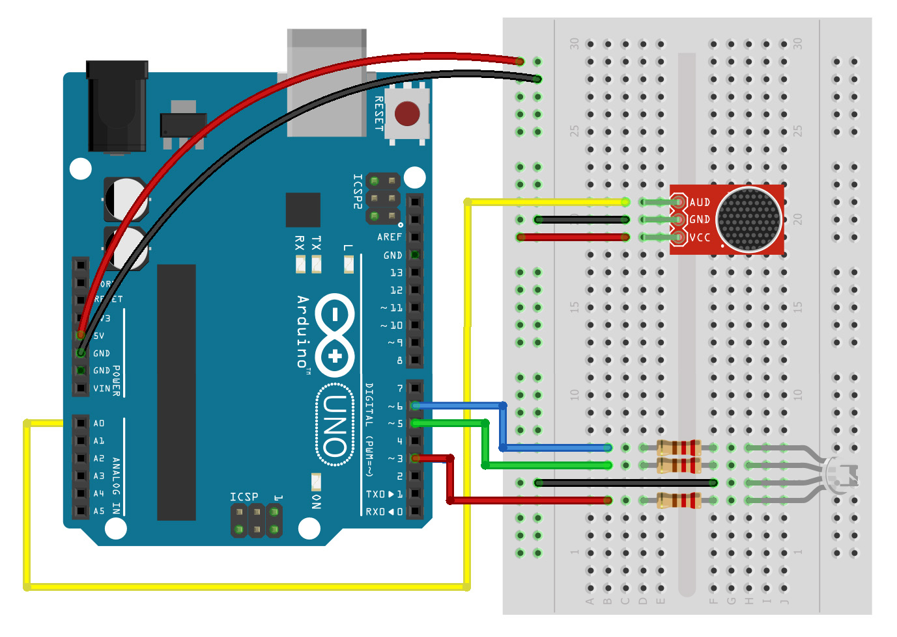
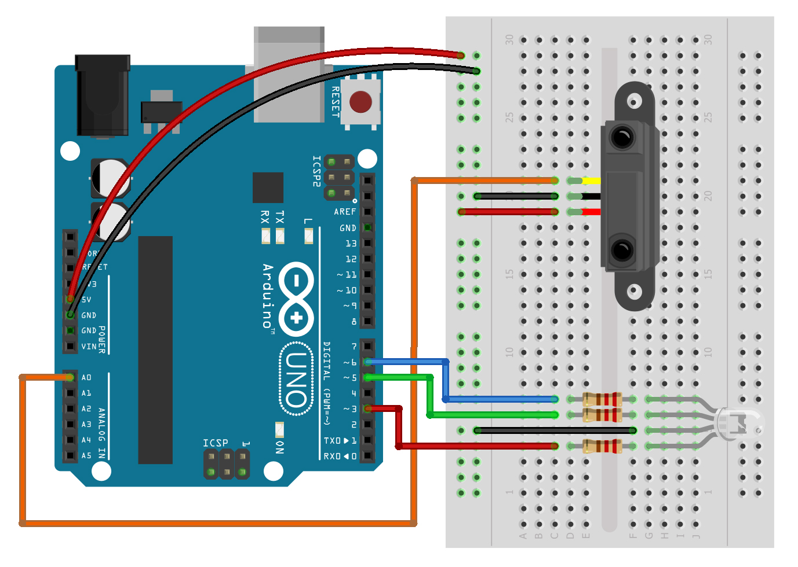

# clase 3

Movimiento, comunicación y autonomía de prototipos

Miercoles 31 mayo 2023

Hoy aprenderemos:

- Sensores de señal analógica
- Uso e instalación de librerías
- Movimiento físico con motor servo
- Autonomía de prototipos electrónicos

## enlaces a ejemplos de esta clase

- [ejemplos/ej_04_rgb_analogico/](./ejemplos/ej_04_rgb_analogico/)

## ejercicio 4: LED RGB y entrada analógica (sensor de sonido)

[ejemplos/ej_04_rgb_analogico/](./ejemplos/ej_04_rgb_analogico/)

## ejercicio 5: LED RGB y entrada analógica 2 (sensor de proximidad SHARP)

Ambos casos usan el mismo código por ser sensore de entrada analógica.

[ejemplos/ej_04_rgb_analogico/](./ejemplos/ej_04_rgb_analogico/)

## uso e instalación de librerías

#include <Servo.h>   // incluir librería servo
Servo servo1;        // crear objeto servo

## ejercicio 6: motor servo y entrada analógica (sensor de proximidad SHARP)

[ejemplos/ej_05_servo_analogico/](./ejemplos/ej_05_servo_analogico/)

## ejercicio 6 alternativo: motor servo y entrada analógica (potenciómetro)

[ejemplos/ej_05_servo_analogico/](./ejemplos/ej_05_servo_analogico/)
